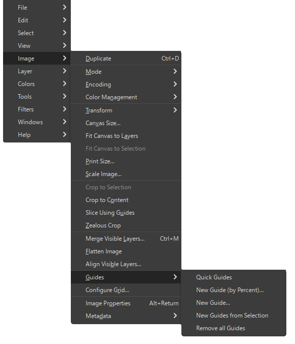
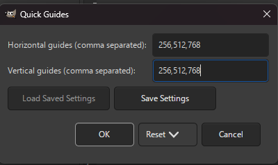

# Gimp3 Quick Guides Plugin

A Python plugin for GIMP 3.0+ that provides quick guide configuration

## Installation

Follow the [tutorial](https://thegimptutorials.com/how-to-install-gimp-plugins/):
* Copy `gimp3_quick_guides.py` into your GIMP 3.0 plugins directory and make it executable
* Install Python (if needed)
* Restart GIMP

## Usage

The plugin is available in the menu bar or the image context menu "Image" > "Guides" > "Quick Guides".
Horizontal and vertical guides will be added/deleted based on comma-separated lists:

